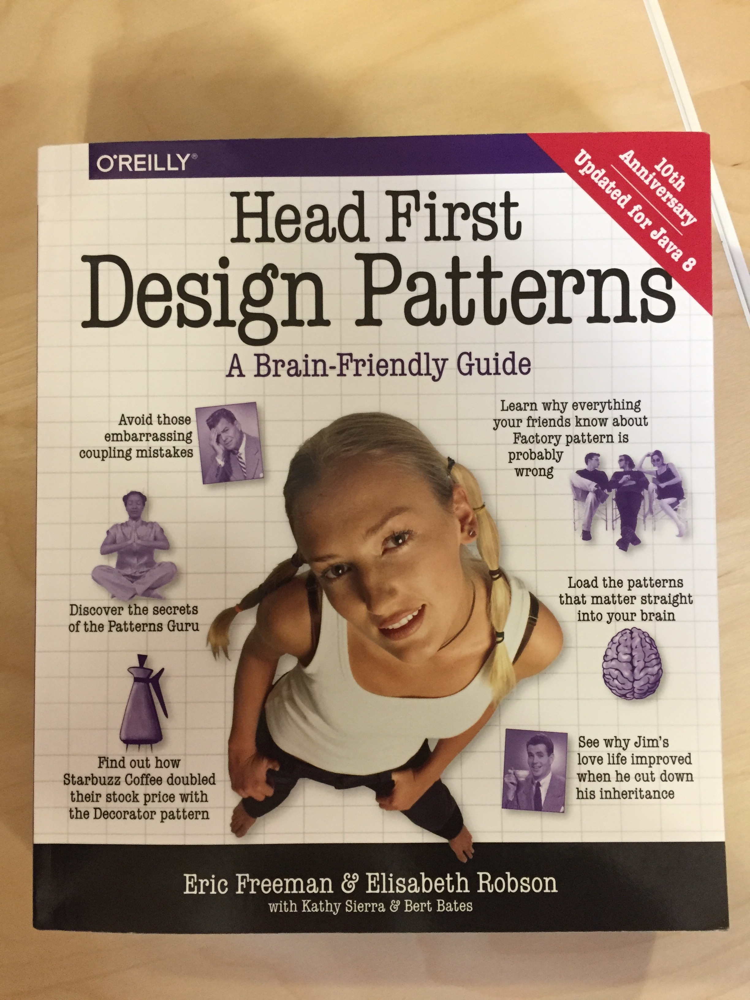
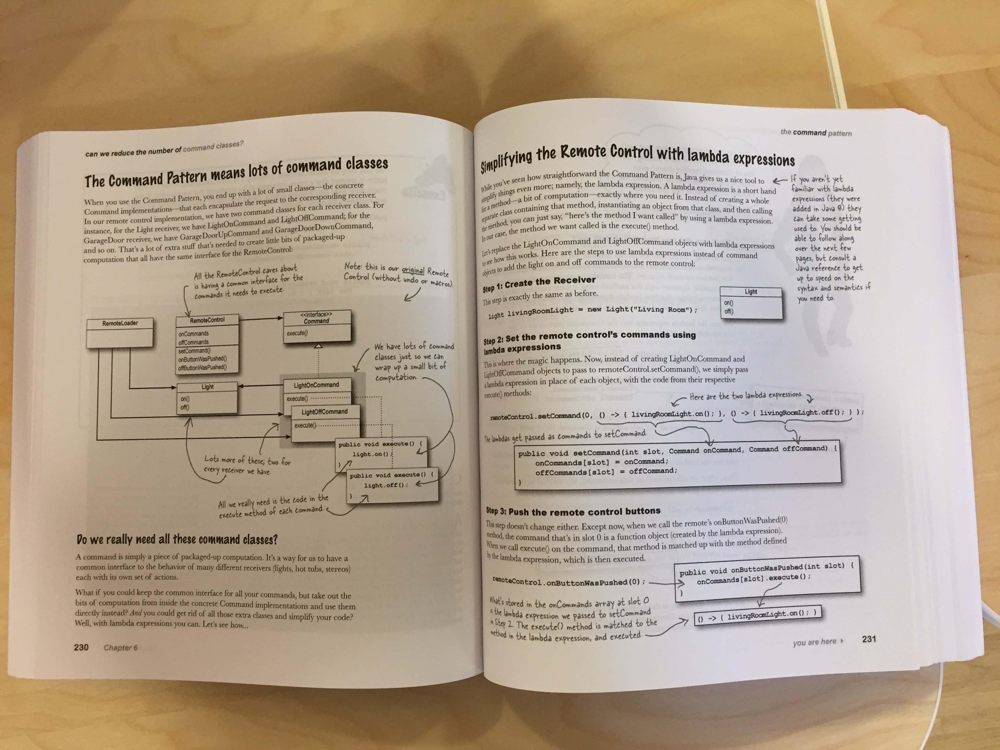

# Design Patterns, the TypeScript way

### What and Why

As we get every day involved into bigger (and possibly complex) codebases, learning and recognizing most common Design Patterns becomes more and more a necessary skill for us

From the formal definition: "a Pattern is a solution to a problem in a context", which honestly doesn't say much

On the other side, "an AntiPattern tells you how to go from a problem to a BAD solution"

Ok, got it, a Pattern is the other way around, a general design which others can apply as solution to a recurring problem.. probably the formal definition was better :)

Patterns can be mostly categorized based on their intent:

-   Creational Patters: involve object instantiation and all provide a way to decouple a client from the objects it needs to instantiate

    -   Singleton
    -   Factory Method (aka Simple Factory)
    -   Abstract Factory (aka Factory)

-   Behavioral Patterns: concerned with how classes and objects interact and distribute responsibility

    -   Template
    -   Iterator
    -   Command
    -   Observer
    -   State
    -   Strategy

-   Structural Patterns: let you compose classes or objects into larger structures

    -   Decorator
    -   Proxy
    -   Composite
    -   Facade
    -   Adapter

 

### What you can find here

Reading through "Head First Design Patterns", I decided to implement the examples by myself using TypeScript

It mostly worked out well, even if sometimes the original examples (in Java) rely quite heavily on built-in constructs not present in JS; therefore, I had to find "the JS way" to the solution

If you are curious, [here](https://github.com/bethrobson/Head-First-Design-Patterns) you can find the original Java implementations

 

### Conclusions

First of all, I strongly recommend the book: it makes difficult topics easier, without all the boring frame that usually comes with those kind of technical books

Even more, no matter which book or other learning resource you choose, please please please help yourself and the other developers around you to learn and talk Design Patters:

-   avoids you reinventing the wheel over and over: you can save that time for bigger and more challenging tasks, or for a beer with friends

-   provides a shared vocabulary between developers: the phrase "let's go for the State Pattern" is more clear and concise than a 40 minutes discussion about implementation details

 
 

 
 

